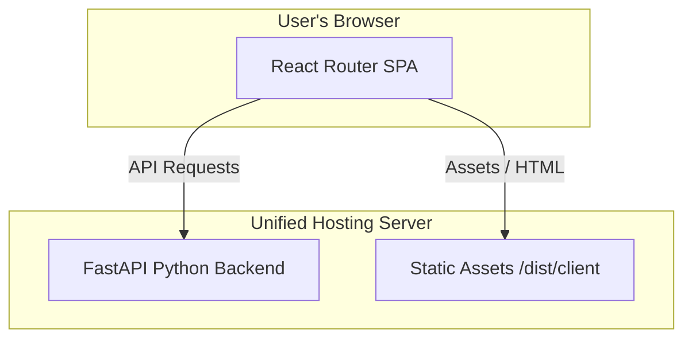

# 🌌 Sweet Sync Vault

An ultra-premium, modern media utility platform featuring a powerful **YouTube Downloader** and an AI-driven **Video Background Remover**. Built with Vite + React on the frontend and FastAPI + Python on the backend.

---

## ⚡ Deployment Options

Choose the deployment architecture that best fits your hosting budget and requirements.

### Option A: Unified Container Serving (Recommended)
Serve both frontend and backend from a single running container on a single port. Extremely cost-effective and runs on any container host.

[](https://render.com/new)
[](https://railway.app/new)

**How it works:**
1. Connect this repository to your container hosting service (Render, Railway, Fly.io, etc.).
2. The platform automatically detects our multi-stage `Dockerfile`.
3. It compiles the React frontend, builds the Python backend, installs `ffmpeg` and AI libraries, and serves both under port `8000`.
4. Done! One-click deploy, no environment variable configuration needed.

---

### Option B: Hybrid Serving (Vercel Frontend + Container Backend)
Host the ultra-fast React frontend on Vercel's global Edge CDN, while keeping the resource-heavy Python processing running on a container server.

[](https://vercel.com/new/clone?repository-url=https%3A%2F%2Fgithub.com%2F)

**How it works:**
1. Deploy the Python backend using our root `Dockerfile` to Render, Fly.io, or Railway as a Web Service. Let's say your backend url is `https://my-backend.render.com`.
2. Click the **Deploy with Vercel** button above to import your repository.
3. In Vercel, set the following environment variable:
   - **Name:** `VITE_PY_BACKEND_URL`
   - **Value:** `https://my-backend.render.com` (no trailing slash)
4. Vercel will automatically compile the frontend static files from `dist/client/` and serve them with zero-downtime performance!

---

## 🛠️ Local Development

Spin up both the Vite frontend and FastAPI backend concurrently with a single command:

```bash
# 1. Install frontend dependencies
npm install

# 2. Run the integrated development servers
npm run dev
```

The script will automatically detect and activate your Python virtual environment (`.venv`), launch both uvicorn and Vite, handle port assignment, and gracefully shut down both servers on `Ctrl+C`.

---

## 📐 Architecture Breakdown



- **Frontend:** React, Vite, Tailwind CSS, Lucide icons, TanStack React Router & Query.
- **Backend:** FastAPI, Python, `rembg` (AI model for background removal), OpenCV, `ffmpeg` (for video muxing).
- **Tooling:** Node.js `child_process` orchestrator for native Windows/Unix space-safe parallel process spawning.
